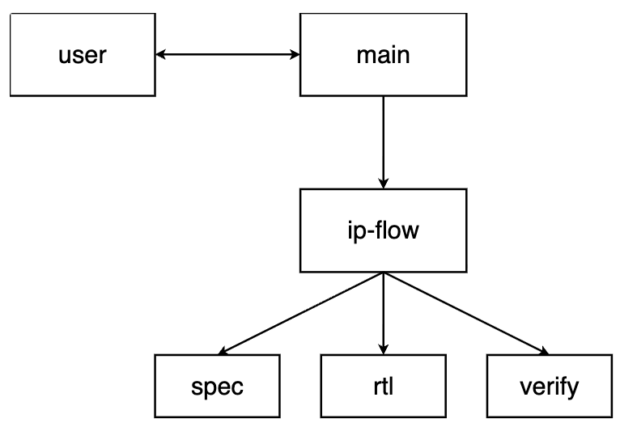

# RISCV-MINI

使用 opencode 开发的简易 vibe coding 项目，旨在体验多 agent 协作 workflow。

## 基本 Prompt

假设我现在要完成一个数字IP的开发，需要 3 个 agent：

1. 需求分析 agent：负责分析用户的需求，并生成 spec，且 spec 需要由用户审批。
2. RTL 编写 agent：负责编写 RTL 代码。
3. 验证 agent：负责 RTL 的验证。
   请你给我一个详细的教程，需要你告诉我：
4. 我应该创建一个怎么样的项目目录？
5. 我编写的 skill，markdown，以及 ai 生成的文档都应该分别放到哪里？
6. 我应该怎么启动三个 agent，并实现他们之间的协作？
7. 我应该准备什么样的工具？

## Agent 相关目录组成

* `opencode.json:1`：项目级 opencode 配置，声明本地 skill 路径，并注册 spec-agent、rtl-agent、verify-agent 三个 subagent。
* `.opencode`
  * `.opencode/agents/`：各 agent 的角色定义和权限配置。
    * `.opencode/agents/ip-flow-agent.md`：主编排 agent，负责协调需求、规格、RTL、验证阶段流转。
    * `.opencode/agents/spec-agent.md`：需求分析 agent，负责生成 docs/spec/ip_spec.md 和审批文档。
    * `.opencode/agents/rtl-agent.md`：RTL 实现 agent，只能基于已批准 spec 写 rtl/src/ 和更新微架构文档。
    * `.opencode/agents/verify-agent.md`：验证 agent，负责验证计划、testbench、assertions、测试报告。
  * `.opencode/commands/`：自定义斜杠命令入口，比如 ip-flow.md、spec.md、rtl.md、verify.md，用于触发对应流程或 agent。
  * `.opencode/skills/digital-ip-flow/SKILL.md`：数字 IP 开发 skill，定义需求、RTL、验证三阶段工作流。
* `Makefile` ：将实际的 scripts 脚本封装到 makefile 中，约束 Agent 调用 tools 的行为。
* `scripts` :  tools 具体实现。
* `docs` 各种项目文档都放在这里面。
  用户只需要在 `docs/requirements/user_request.md` 里面提要求，告知 ip-flow-agent 进行审查，并在 `docs/spec/approval.md` 里通过审查，再告知 ip-flow-agent 开始指挥各个 agent 进行操作。

## Agent 协作关系

人只需要和 main agent 进行交互。

## 人的工作流

1. 首先人需要对一个项目进行分解，并组织 Agent 架构，一般来说每个 Agent 负责处理一个子任务，需要有一个 Agent 负责统领全局。
2. 搞清运行该项目都需要哪些命令和工具，提前在本地安装。
3. 组织好项目目录，各种 skills，md，docs 等。
4. 上面的准备过程都可以和主 agent 协作进行，准备就绪后，启动项目开始执行。

## 待挖掘部分

* 添加用户 app，让 CPU 可以运行简单的示例程序。
* 在 CPU 基础上搭建 SoC，形成计算机系统。
